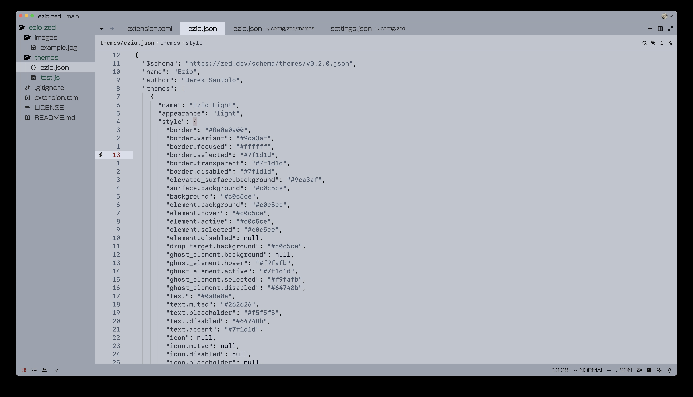

# ezio-zed

The Ezio theme for Zed.



Currently, the theme assumes you have the following Zed settings:

```
{
  "current_line_highlight": "gutter",
}
```

I also recommend

```
"scrollbar": {
    "git_diff": false,
    "diagnostics": "none",
}
```

Ezio is a minimalistic, low-color-range theme for Zed. There is currently only a light theme, but I have plans to add a dark version in the future.

- It attempts to remove as many of the default UI elements as possible, while still remaining functional and easy to use.

- Instead of using a large number of colors to differentiate between syntax tokens, Ezio uses a small number of colors to achieve a clean and readable look. The theme only uses color to differentiate between comments, strings, and all other tokens. Beyond that, it differentiates between other syntax tokens via font weight. I really have to credit Zed for allowing this type of configuration, as otherwise the theme wouldn't work nearly as well, and likely be too extreme for most people.

- Ezio is supposed to be a "light" theme (where text is darker than its background), while still using a relatively dark background color to be easy to look at for long periods of time.

- The color scheme is inspired by the one used in Assassin's Creed 2's menus, but no attempts were made to lift the exact colors from that game.

- While using this myself, I have noticed that my approach to creating is prone to two errors: 1. removing UI elements that are essential in some cases, and therefore should be added back; 2. the choice to use few colors causing certain parts of the UI to blend unintentionally. If you see anything along these lines, please feel free to let me know via an issue or PR! I would like this theme to always be usable, you shouldn't have to switch to a different one to be able to use Zed.
